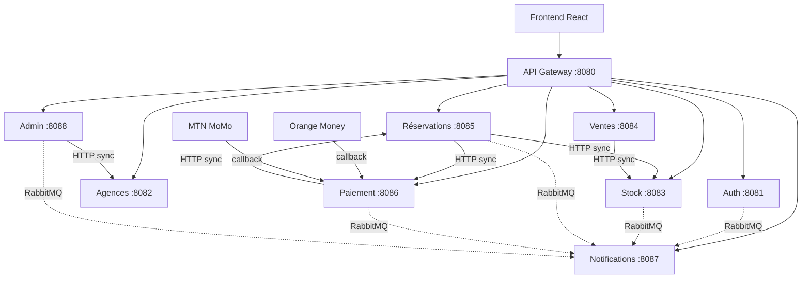

# Rapport API — Plateforme GPG (Gestion Distribution Gaz)

> **Base URL Gateway :** `http://localhost:8080`  
> **Authentification :** JWT Bearer dans l'en-tête `Authorization: Bearer <token>`  
> **Date :** 2026-07-03

---

## Architecture des communications



### Communications synchrones (REST)

| Source | Destination | Endpoint appelé | Usage |
|--------|-------------|-----------------|-------|
| Ventes | Stock | `POST /api/stocks/decrementer` | Décrémenter stock après vente |
| Ventes | Stock | `POST /api/stocks/approvisionner` | Approvisionnement |
| Réservations | Stock | `GET /api/stocks/agence/{id}/categorie/{catId}` | Prix + disponibilité |
| Réservations | Stock | `POST /api/stocks/decrementer` | Après paiement confirmé |
| Réservations | Paiement | `POST /api/paiements/initier` | Lancer Mobile Money |
| Paiement | Réservations | `PUT /api/reservations/{id}/paiement` | Confirmer paiement |
| Paiement | Réservations | `PUT /api/reservations/{id}/annuler` | Échec paiement |

### Communications asynchrones (RabbitMQ — exchange `gdg.exchange`)

| Routing key | Émetteur | Consommateur | Action |
|-------------|----------|--------------|--------|
| `user.registered` | Auth | Notifications | Email vérification |
| `password.reset` | Auth | Notifications | Email reset mdp |
| `user.suspended` | Admin | Notifications | Alerte suspension |
| `agence.validee` | Admin | Notifications | Email agence validée |
| `stock.critique` | Stock | Notifications | Alerte seuil critique (RG-06) |
| `stock.disponible` | Stock | Notifications | Notifier abonnés |
| `reservation.confirmee` | Réservations | Notifications | Notifier distributeur |
| `paiement.confirme` | Paiement | Notifications | Confirmation consommateur |
| `paiement.echoue` | Paiement | Notifications | Échec paiement |

### Callbacks externes (publics, sans JWT)

| Opérateur | URL Gateway | Body |
|-----------|-------------|------|
| Orange Money | `POST /api/paiements/callback/orange` | `{ "referenceTransaction", "referenceOperateur", "statut": "SUCCESS" }` |
| MTN MoMo | `POST /api/paiements/callback/mtn` | idem |

---

## Prérequis de démarrage

```bash
# 1. RabbitMQ
docker compose up -d

# 2. PostgreSQL avec schémas (schema.sql)

# 3. Démarrer les services (dans l'ordre recommandé)
# Auth 8081, Agences 8082, Stock 8083, Ventes 8084,
# Réservations 8085, Paiement 8086, Notifications 8087, Admin 8088, Gateway 8080
```

---

## 1. SERVICE AUTH — Port 8081

| Méthode | Endpoint Gateway | Auth | Description | Réponse attendue |
|---------|------------------|------|-------------|------------------|
| POST | `/auth/register/consommateur` | Public | Inscription consommateur | `201` `{ token, role, userId }` |
| POST | `/auth/register/distributeur` | Public | Inscription distributeur | `201` |
| POST | `/auth/register/admin` | Public | Inscription administrateur | `201` |
| POST | `/auth/login` | Public | Connexion | `200` `{ token, role, email }` |
| POST | `/auth/logout` | JWT | Déconnexion | `200` |
| GET | `/auth/verify-email?token=` | Public | Vérification email | `200` |
| GET | `/auth/profil` | JWT | Profil utilisateur | `200` |
| POST | `/auth/forgot-password` | Public | Demande reset | `200` |
| POST | `/auth/reset-password` | Public | Nouveau mot de passe | `200` |

**Exemple login :**
```http
POST http://localhost:8080/auth/login
Content-Type: application/json

{
  "email": "client@example.com",
  "motDePasse": "password123"
}
```

---

## 2. SERVICE AGENCES — Port 8082

| Méthode | Endpoint Gateway | Auth | Description | Réponse |
|---------|------------------|------|-------------|---------|
| GET | `/api/enseignes` | Public | Liste enseignes | `200` `[{ id, nom, logo, statut }]` |
| GET | `/api/enseignes/actives` | Public | Enseignes actives | `200` |
| GET | `/api/enseignes/{id}` | Public | Détail enseigne | `200` |
| POST | `/api/enseignes` | Admin | Créer enseigne | `201` |
| GET | `/api/villes` | Public | Liste villes | `200` |
| GET | `/api/villes/{id}` | Public | Détail ville | `200` |
| POST | `/api/villes` | Admin | Ajouter ville | `201` |
| GET | `/api/agences/actives` | Public | Agences visibles (RG-13) | `200` |
| GET | `/api/agences/{id}` | Public/JWT | Détail agence | `200` |
| GET | `/api/agences/ville/{villeId}` | Public | Filtrer par ville | `200` |
| GET | `/api/agences/enseigne/{enseigneId}` | Public | Par enseigne | `200` |
| POST | `/api/agences` | Distributeur | Créer agence (EN_ATTENTE) | `201` |
| PUT | `/api/agences/{id}` | Distributeur | Modifier profil | `200` |
| PUT | `/api/agences/{id}/valider` | Admin | Valider agence | `200` |
| PUT | `/api/agences/{id}/suspendre` | Admin | Suspendre | `200` |

**Exemple — consulter agences actives :**
```http
GET http://localhost:8080/api/agences/actives
```

---

## 3. SERVICE STOCK — Port 8083 ⭐

| Méthode | Endpoint Gateway | Auth | Description | Réponse |
|---------|------------------|------|-------------|---------|
| GET | `/api/categories` | Public | Catégories 3/9/12.5/30 kg | `200` `[{ id, libelle, poids, prixUnitaire }]` |
| GET | `/api/categories/{id}` | Public | Détail catégorie | `200` |
| GET | `/api/stocks/public/{agenceId}/disponibilite` | Public | Dispo globale (RG-08) | `200` `{ agenceId, disponible: true/false }` |
| GET | `/api/stocks/agence/{agenceId}` | JWT Consommateur | Stock détaillé | `200` `[{ categorieLibelle, quantiteDisponible, prixUnitaire, etat }]` |
| GET | `/api/stocks/agence/{agenceId}/categorie/{catId}` | JWT | Stock précis | `200` |
| GET | `/api/stocks/agence/{agenceId}/critiques` | JWT Distributeur | Seuils critiques | `200` |
| POST | `/api/stocks/decrementer` | Interne/Distributeur | Sortie stock (RG-05) | `200` `{ mouvementId, quantiteApres, alerteCritiqueDeclenchee }` |
| POST | `/api/stocks/approvisionner` | Distributeur | Entrée stock | `200` |
| PATCH | `/api/stocks/agence/{agenceId}/categorie/{catId}/seuil` | Distributeur | Seuil critique (RG-07) | `200` |
| GET | `/api/stocks/agence/{agenceId}/historique` | Distributeur | Mouvements (RG-15) | `200` |

**Exemple décrément (appelé par Ventes/Réservations) :**
```http
POST http://localhost:8080/api/stocks/decrementer
Content-Type: application/json

{
  "agenceId": 1,
  "categorieProduitId": 1,
  "quantite": 2,
  "referenceExterne": "VTE-2026-00001",
  "effectuePar": 5
}
```

---

## 4. SERVICE VENTES — Port 8084 ⭐

| Méthode | Endpoint Gateway | Auth | Description | Réponse |
|---------|------------------|------|-------------|---------|
| POST | `/api/ventes` | Distributeur | Enregistrer vente (RG-05, RG-17) | `201` `VenteResponse` + facture |
| GET | `/api/ventes/{id}` | JWT | Détail vente | `200` |
| GET | `/api/ventes/reference/{ref}` | JWT | Par référence | `200` |
| GET | `/api/ventes/agence/{agenceId}` | Distributeur | Historique agence | `200` |
| GET | `/api/ventes/agence/{agenceId}/paginated` | Distributeur | Historique paginé | `200` |
| GET | `/api/ventes/agence/{agenceId}/ca` | Distributeur | Chiffre d'affaires | `200` `Double` |
| GET | `/api/ventes/distributeur/{id}` | Distributeur | Ventes par agent | `200` |
| POST | `/api/approvisionnements` | Distributeur | Approvisionner stock | `201` `{ message }` |
| GET | `/api/factures/{id}` | JWT | Facture PDF metadata | `200` |
| GET | `/api/factures/vente/{venteId}` | JWT | Facture d'une vente | `200` |

**DTO VenteRequest :**
```json
{
  "agenceId": 1,
  "distributeurId": 5,
  "consommateurId": null,
  "categorieProduitId": 2,
  "quantite": 1,
  "prixUnitaire": 6500,
  "modePaiement": "CASH",
  "typeVente": "HORS_LIGNE",
  "nomClient": "Jean Dupont",
  "telephoneClient": "677123456"
}
```

**Flux vente :** Vente enregistrée → Stock décrémenté (sync) → Facture générée → Alerte RabbitMQ si seuil critique.

---

## 5. SERVICE RÉSERVATIONS — Port 8085 ⭐

| Méthode | Endpoint Gateway | Auth | Description | Réponse |
|---------|------------------|------|-------------|---------|
| POST | `/api/reservations` | Consommateur | Créer réservation (RG-16, RG-18) | `201` `ReservationResponse` |
| GET | `/api/reservations/{id}` | JWT | Détail | `200` |
| GET | `/api/reservations/consommateur/{id}` | Consommateur | Mes réservations | `200` |
| GET | `/api/reservations/consommateur/{id}/actives` | Consommateur | Actives (EN_ATTENTE) | `200` |
| GET | `/api/reservations/agence/{id}` | Distributeur | Réservations reçues | `200` |
| PUT | `/api/reservations/{id}/paiement?referencePaiement=` | Interne/Paiement | Confirmer paiement | `200` statut PAYEE |
| PUT | `/api/reservations/{id}/confirmer-disponibilite?distributeurId=` | Distributeur | Confirmer dispo | `200` CONFIRMEE |
| PUT | `/api/reservations/{id}/recuperer?consommateurId=` | Consommateur | Gaz récupéré | `200` RECUPEREE |
| PUT | `/api/reservations/{id}/annuler?motif=&effectuePar=` | JWT | Annuler | `200` ANNULEE |
| GET | `/api/reservations/statistiques` | Admin | Stats globales | `200` |
| GET | `/api/reservations/{id}/historique` | JWT | Historique statuts | `200` |

**DTO ReservationRequest :**
```json
{
  "agenceId": 1,
  "consommateurId": 10,
  "categorieProduitId": 2,
  "quantite": 1,
  "modePaiement": "ORANGE_MONEY",
  "numeroTelephone": "677123456"
}
```

**Flux réservation (RG-16) :**
1. Vérification stock sync (Stock)
2. Création EN_ATTENTE + expiration 30 min
3. Initiation paiement sync (Paiement) si Mobile Money
4. Callback opérateur → Paiement confirme → Réservations PAYEE → Stock décrémenté
5. Event RabbitMQ `reservation.confirmee`

---

## 6. SERVICE PAIEMENT — Port 8086 ⭐

| Méthode | Endpoint Gateway | Auth | Description | Réponse |
|---------|------------------|------|-------------|---------|
| POST | `/api/paiements/initier` | JWT/Interne | Lancer Mobile Money | `201` `{ id, referenceTransaction, statut: EN_ATTENTE }` |
| POST | `/api/paiements/callback/orange` | Public | Callback Orange | `200` |
| POST | `/api/paiements/callback/mtn` | Public | Callback MTN | `200` |
| POST | `/api/paiements/callback/orange/simuler` | Test | Simuler succès Orange | `200` |
| POST | `/api/paiements/callback/mtn/simuler` | Test | Simuler succès MTN | `200` |
| GET | `/api/paiements/{id}` | JWT | Statut paiement | `200` |
| GET | `/api/paiements/reference/{ref}` | JWT | Par référence | `200` |
| GET | `/api/paiements/client/{clientId}` | JWT | Historique client | `200` |
| PUT | `/api/paiements/{id}/valider` | Admin/Test | Valider manuellement | `200` CONFIRME |
| PUT | `/api/paiements/{id}/annuler` | JWT | Annuler | `200` ECHOUE |

**DTO InitierRequest :**
```json
{
  "reservationId": 42,
  "consommateurId": 10,
  "agenceId": 1,
  "montant": 6500,
  "modePaiement": "ORANGE_MONEY",
  "numeroTelephone": "677123456"
}
```

**Simuler callback (dev/test) :**
```http
POST http://localhost:8080/api/paiements/callback/orange/simuler
Content-Type: application/json

{
  "referenceTransaction": "PAY-2026-ABC12345",
  "statut": "SUCCESS"
}
```

---

## 7. SERVICE NOTIFICATIONS — Port 8087

| Méthode | Endpoint Gateway | Auth | Description |
|---------|------------------|------|-------------|
| GET | `/api/notifications/utilisateur/{id}` | JWT | Mes notifications |
| PUT | `/api/notifications/{id}/lire` | JWT | Marquer lue |
| POST | `/api/abonnements` | Consommateur | S'abonner (RG-12) |
| DELETE | `/api/abonnements/{id}` | Consommateur | Se désabonner |
| GET | `/api/abonnements/consommateur/{id}` | Consommateur | Mes abonnements |
| POST | `/api/signalements` | Consommateur | Signaler rupture/dispo (RG-09) |
| GET | `/api/signalements/consommateur/{id}` | Consommateur | Mes signalements |

---

## 8. SERVICE ADMIN — Port 8088

| Méthode | Endpoint Gateway | Auth | Description |
|---------|------------------|------|-------------|
| GET | `/admin/dashboard` | Admin | Tableau de bord global |
| GET | `/admin/agences/en-attente` | Admin | Demandes validation |
| PUT | `/admin/agences/{id}/valider` | Admin | Valider (RG-13) |
| PUT | `/admin/agences/{id}/rejeter` | Admin | Rejeter avec motif |
| GET | `/admin/utilisateurs` | Admin | Liste comptes |
| PUT | `/admin/utilisateurs/{id}/suspendre` | Admin | Suspendre (RG-14) |
| GET | `/admin/signalements` | Admin | Signalements (RG-10) |
| GET | `/admin/stocks/global` | Admin | Vue stocks toutes agences |

---

## Scénario métier complet (test manuel)

### Étape 1 — Connexion distributeur
```http
POST http://localhost:8080/auth/login
{ "email": "dist@total.cm", "motDePasse": "test123" }
→ Copier le token
```

### Étape 2 — Consulter stock public (visiteur)
```http
GET http://localhost:8080/api/stocks/public/1/disponibilite
→ { "agenceId": 1, "disponible": true }
```

### Étape 3 — Enregistrer une vente cash
```http
POST http://localhost:8080/api/ventes
Authorization: Bearer <token>
{ "agenceId": 1, "distributeurId": 5, "categorieProduitId": 2,
  "quantite": 1, "prixUnitaire": 6500, "modePaiement": "CASH", "typeVente": "HORS_LIGNE" }
→ 201 + facture
```

### Étape 4 — Réservation + paiement Mobile Money
```http
POST http://localhost:8080/api/reservations
Authorization: Bearer <token_consommateur>
{ "agenceId": 1, "consommateurId": 10, "categorieProduitId": 2,
  "quantite": 1, "modePaiement": "ORANGE_MONEY", "numeroTelephone": "677000000" }
→ 201 { id, referenceReservation, referencePaiement, statut: EN_ATTENTE }

POST http://localhost:8080/api/paiements/callback/orange/simuler
{ "referenceTransaction": "<referencePaiement>", "statut": "SUCCESS" }
→ Réservation PAYEE, stock décrémenté, notification envoyée
```

---

## Compilation — Résultats

| Service | Port | Compilation | Runtime testé |
|---------|------|-------------|---------------|
| Gateway | 8080 | ✅ OK | ✅ Routes publiques OK |
| Auth | 8081 | — | — |
| Agences | 8082 | ✅ OK | ✅ `/api/agences/actives` → 200 |
| Stock | 8083 | ✅ OK | ✅ `/api/categories` → 200 |
| Ventes | 8084 | ✅ OK | ✅ `/api/ventes/agence/1` → 200 |
| Réservations | 8085 | ✅ OK | ✅ Stats → 200, sync Stock OK |
| Paiement | 8086 | ✅ OK | ✅ `/api/paiements` → 200 |
| Notifications | 8087 | ✅ OK | — |
| Admin | 8088 | — | — |

### Tests Gateway (2026-07-03)

| Endpoint | Résultat | Note |
|----------|----------|------|
| `GET /api/categories` | ✅ 200 | Public |
| `GET /api/stocks/public/1/disponibilite` | ✅ 200 | Public (RG-08) |
| `GET /api/enseignes` | ✅ 200 | Public |
| `GET /api/villes` | ✅ 200 | Public |
| `GET /api/agences/actives` | ✅ 200 | Public |
| `GET /api/reservations/statistiques` | 🔒 401 | JWT requis (comportement attendu) |
| `GET /api/paiements` | 🔒 401 | JWT requis |
| `GET /api/ventes/agence/1` | 🔒 401 | JWT requis (DISTRIBUTEUR) |

### Test flux métier Réservation → Stock → Paiement

1. **Prérequis** : exécuter `scripts/init-stock.sql` pour créer le stock agence 1
2. **Créer réservation** : `POST /api/reservations` → vérifie stock sync, initie paiement
3. **Simuler callback** : `POST /api/paiements/callback/orange/simuler` avec `referenceTransaction`
4. **Résultat** : réservation PAYEE, stock décrémenté, notification RabbitMQ (si Docker actif)

```bash
# 1. Initialiser le stock
psql -U postgres -d gdg_auth -f scripts/init-stock.sql

# 2. Créer une réservation (direct ou via gateway + JWT)
curl -X POST http://localhost:8085/api/reservations \
  -H "Content-Type: application/json" \
  -d @scripts/test-reservation.json

# 3. Simuler le callback Orange Money
curl -X POST http://localhost:8086/api/paiements/callback/orange/simuler \
  -H "Content-Type: application/json" \
  -d '{"referenceTransaction":"PAY-2026-XXXX","statut":"SUCCESS"}'
```

---

## Fichiers modifiés / créés

- `VenteRequest.java`, `ApprovisionnementRequest.java` — DTOs ventes
- `ApprovisionnementController.java` — proxy vers Stock
- Gateway routes alignées sur `/api/**`
- Clients inter-services : `StockServiceClient`, `PaiementServiceClient`, `ReservationClient`
- RabbitMQ : events stock, reservation, paiement + listeners Notifications
- `docker-compose.yml` — RabbitMQ 3.13
- SecurityConfig sur Stock, Ventes, Réservations, Paiement

---

## Notes

- **Docker** : démarrer Docker Desktop puis `docker compose up -d` pour RabbitMQ.
- **PostgreSQL** : exécuter `schema.sql` avant de lancer les services.
- Les endpoints `/simuler` permettent de tester les callbacks sans vraie API Orange/MTN.
